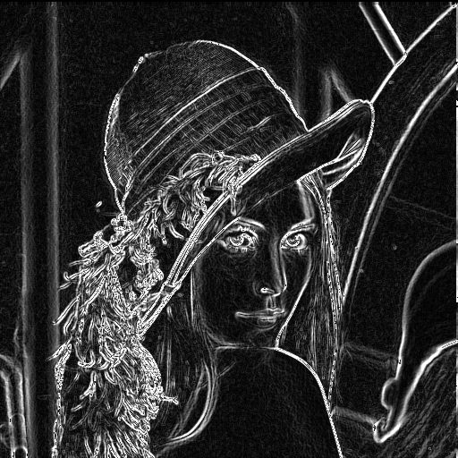

# Pipelined Image Convolution Accelerator

## 📌 Overview
This repository contains a high-performance, modular **RTL implementation** of a 2D convolution engine designed for real-time image processing. The architecture is fully parameterized, allowing for variable kernel sizes and image resolutions, optimized for deployment on the **Xilinx ZedBoard (Zynq-7000)**.

## 🚀 Key Features
* **Parameterized Design**: Configurable kernel dimensions (3x3, 5x5, etc.) and data bit-widths via Verilog parameters.
* **Pipelined Architecture**: Achieves a throughput of **1 pixel per clock cycle** using a streaming data path.
* **Hardware Optimized**: Efficiently utilizes dedicated **DSP48 slices** for arithmetic and **Block RAM** for line buffering.
* **Robust Verification**: Includes a comprehensive testbench suite capable of processing real `.bmp` image files through Verilog File I/O.

---

## 🏗️ Architecture
The design utilizes a **Sliding Window Architecture** to minimize external memory access:
1.  **Line Buffer Unit**: Uses Dual-Port RAM to store rows of the image, providing concurrent access to pixels.
2.  **MAC Array**: A parallel array of 60 Multiply-Accumulate units that compute the convolution sum in a single cycle.
3.  **Pipeline Stages**: Synchronous registers separate memory access, multiplication, and summation to maximize clock frequency.

---

## 📊 Implementation Results (Target: ZedBoard)
Post-Implementation results confirm the design meets high-speed timing constraints with minimal resource overhead.

### **Resource Utilization**
| Resource | Used | Available | Utilization |
| :--- | :--- | :--- | :--- |
| **Slice LUTs** | 68 | 53,200 | 0.13% |
| **Slice Registers** | 227 | 106,400 | 0.21% |
| **DSPs** | 60 | 220 | 27.27% |
| **Block RAM** | 1 | 140 | 0.71% |
*(Source: [utilization_report.txt](./docs/utilization_report.txt))*

### **Timing Summary**
* **Worst Negative Slack (WNS)**: 0.592 ns (Met)
* **Total Negative Slack (TNS)**: 0.000 ns
* **Clock Frequency**: 100 MHz

---

## 🖼️ Verification Results
The design was verified by applying a **Sobel Edge Detection** filter to the standard 512x512 "Lena" grayscale image. The accelerator successfully generated directional gradients and the final edge-detected output.

| Input Image | Sobel Combined Output |
| :---: | :---: |
|  |  |

---

## 📂 Repository Structure
* `rtl/`: Synthesizable Verilog source files.
* `tb/`: Unit and System-level testbenches.
* `sim/`: Input assets and resulting filtered images.
* `docs/`: Implementation reports and timing summaries.

## 🛠️ How to Run
1.  Clone the repo: `git clone <repo-url>`
2.  Open **Vivado 2023.x** and create a project for the ZedBoard.
3.  Add all files in `rtl/` as design sources.
4.  Add `tb/tb_conv_top_real_image.v` as the top-level simulation source.
5.  Run **Behavioral Simulation** to generate output images.